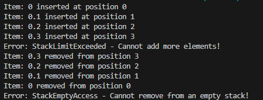
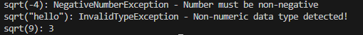
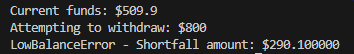

Task1:

{width="3.5754713473315833in"
height="1.3666251093613297in"}{width="2.1044608486439196in"
height="0.3854702537182852in"}Task2:

Task3:

{width="5.302823709536308in"
height="0.5209055118110236in"}{width="4.229757217847769in"
height="0.21878062117235345in"}Task4:

Task5:

{width="3.6880150918635173in"
height="0.5625787401574803in"}
